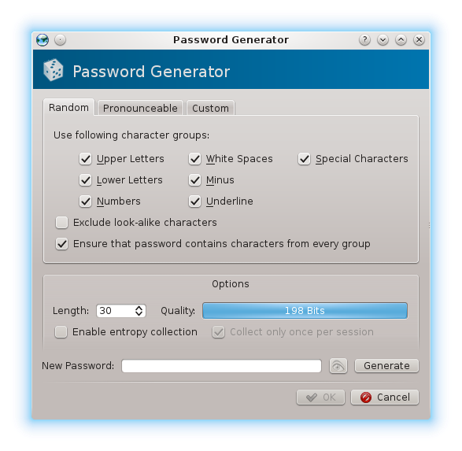

# How to secure your digital data properly
_by Diederik de Haas_

## Part 1: Passwords and passphrases
Passwords and passphrases are essentially the same. Usually the distinction is between using 1 word and multiple words respectively. In this document I will use the term _password_ since it's more commonly known/used word.  
Most people have a severe dislike when it comes to passwords and that's quite understandable. When you want to interact with a site you usually have to register by choosing a username and password. And your password usually has to be of a minimum (and maximum) length, it has to contain both lowercase and uppercase letters and often also a number and a special character. That would be fine and doable if you only have to do it once, but it becomes really annoying and hard when you have to do it tens or hundreds of times. And having to change your password on a regular basis only adds to the problem/annoyance.  

As a result a lot of people resort to using the same username and password over and over again. And quite often the passwords people choose are '123456' or the name of their loved ones/children/pets/etc and/or dates meaningful to those loved ones/children/pets/etc. Those passwords are easily guessed by people who know a thing or two about you. And with the wealth of information people share online, it's often not so hard to guess those by people who don't know you (personally). 
Besides making educated guesses about someone's passwords, there's another way for people to get your password and that's called a _brute force attack_.

A brute force attack is simply trying all possible combinations until you get it right. While it would be a tedious and time consuming process to do manually, computers are quite good at it. With a resonably fast computer you can make millions of guesses **a second**. And when you add (multiple) powerful graphics cards into that mix, that goes up to [billions of guesses a second](http://arstechnica.com/security/2012/08/passwords-under-assault/). What's more, there are (long) list of passwords circulating on the internet with common used passwords which can be (and are) used to narrow down the list of passwords to try. There are also programs which can add intelligence to narrow that list down even further. While substituting an 'a' with an '@' or 'e' with '3' does make your password a bit more secure, it's actually negligible. The reason for that is that it is rather commonly known and moreover people are actually more predictable than we'd like to think. 

While most people probably [think that 'qeadzcwrsfxv1331' would be a good password](http://arstechnica.com/security/2013/05/how-crackers-make-minced-meat-out-of-your-passwords/), it's actually not. Just type it on your keyboard to find out why ;-) The article in the link also shows that some security experts were able to figure out up to 82% of passwords from a list of 16,000 in about an hour, while another one got till 90% in 20 hours.  
Fortunately, a brute force attack isn't able to crack every password. As a (simplistic) rule of thumb, a password of 12 characters or more isn't practically breakable with brute force since it would consume too much time. That is because each character increases the number of passwords to try exponentially.

Ok, so what to do about the password problem? Well, read on.

### Password managers
Password manager are computer programs which can store and (normally) generate passwords. That way when you need to have a new password, you just let it generate for you and then store that in the programs _password safe_. That password safe is just a file, but it is heavily encrypted so that unauthorized access is next to impossible. When generating a password you can specify various options like which characters to use, how long it should be, etc. 
Here's a screenshot of [KeePassX](https://www.keepassx.org/)'s password generator: 

As you can see you can specify various character groups and a length which result in a specific password strength. In the picture you see a length of 30 and a quality of 198 Bits, which is **very** secure and I recommend using this as a default. When you click on the 'eye' icon, you can see what password has been generated and you'll see that it is indeed totally random. It's also impossible to memorize, but you won't have to since that's why you have a password manager.
You will, unfortunately, encounter various places where a site has placed arbitrary restrictions on the password. That can be the maximum length and/or the characters you can use for your password. Of course you should complain about those restrictions. As a second best option you can adjust the password generator settings so that a password is generated which does meet the requirements, which is often shown as part of the error message. 

There are a number of password managers out there and you should select the one which best suites your needs.
- [KeePass](http://keepass.info/) Runs natively on Windows and on other platforms using Mono
- [KeePassX](https://www.keepassx.org/) Cross-platform native port of KeePass
- [1Password](https://agilebits.com/onepassword) Runs natively on Windows and Mac

All of these password managers also have clients for mobile systems.

So now you have the tool to generate and manage secure passwords. But the password manager needs to be secured as well, after all a (normal) safe isn't very secure if you leave the door open. So how do we secure the password manager? Indeed, ... with a password! And since it controls all our passwords, we call it the _master password_.
So we need to find a way to get a secure, memorable master password. But it must not be predictable one, since that's the biggest problem with password humans usually come up with. Fortunately Arnold Reinhold published a solution to this problem back in 1995 and it's called [Diceware](http://world.std.com/~reinhold/diceware.html).   It resolves around 2 main things:
- A word list with less common, but still 'normal' words;
- Rolling dice to select words from that list.

Previously the advice was to select 5 words from the list using dice, but the [author increased that to 6 words in March 2014](http://diceware.blogspot.com/2014/03/time-to-add-word.html) mainly because the advancements in computing power since 1995.

So how does this work? Each word in the [word list](diceware.wordlist.asc) has 5 numbers in front of them, ranging from 1 to 6. To generate our master password, we need 6 (words) times 5 (numbers needed for a word) or 30 dice rolls. Now roll the dice and write down the numbers on a piece of paper, grouped by 5 digits. If you use several dice at once, read them from left to right. Then look up the first 5 digits numbers in the word list and you have your first word of your master password. Repeat that until you have found the words corresponding to the numbers you gathered from rolling the dice. And that's it!

Now you need to memorize your newly created master password, since that's the key to all your (other) passwords. It is fine if you keep a piece of paper with you at first while you memorize it, but make sure you keep it in a really safe place!
If you want an even more secure master password, you can choose to use more then 6 words. Alternatively, when you speak more then 1 language, you can also use [word lists from multiple languages](http://world.std.com/~reinhold/diceware.html#languages). In order to make that random too, roll a dice for the language selection as well. So for example you select a word from the English list when you roll an odd number and a word from the Esperanto list for an even number.

For a more detailed explanation into both the problem and the solution, I recommend reading the [Diceware Passphrase Homepage](http://world.std.com/~reinhold/diceware.html) or the [excellent blog post by Agile Bits](https://blog.agilebits.com/2011/06/21/toward-better-master-passwords/), creators of 1Password.  
The obligatory and right on the mark  ([online version](https://xkcd.com/936/))
